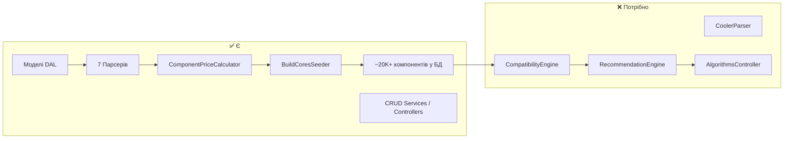
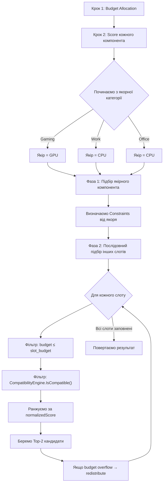
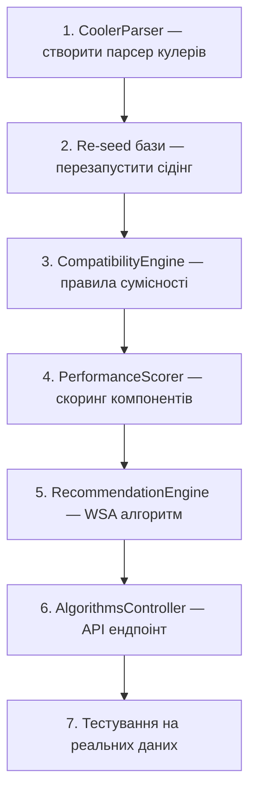

# Recommendation Algorithm — Архітектурний Дизайн

## 1. Загальна картина: де ми і що маємо

### Інвентаризація даних у базі

Перед тим як проєктувати алгоритм, критично важливо зрозуміти, з якими **реальними даними** він працюватиме. Ось повна інвентаризація того, що зберігається в `TechnicalSpecs` (jsonb) по кожній категорії:

| Category | Кількість JSON | TechnicalSpecs ключі | Ключові для сумісності |
|:---|:---:|:---|:---|
| **Cpu** | ~788 | `Cores`, `Threads`, `BaseClock`, `BoostClock`, `TDP`, `Socket`, `MemoryType` | `Socket`, `MemoryType`, `TDP` |
| **Gpu** | ~3798 | `VRAM`, `CoreClock`, `Length`, `TDP`, `Interface` | `TDP`, `Length`, `Interface` |
| **Motherboard** | ~3644 | `Socket`, `FormFactor`, `RamType`, `MaxRam`, `RamSlots` | `Socket`, `RamType`, `FormFactor` |
| **Ram** | ~4478 | `Type`, `Capacity`, `Speed`, `Modules` | `Type` |
| **Psu** | ~3287 | `Wattage`, `FormFactor`, `Efficiency`, `Modular` | `Wattage` |
| **Ssd** | ~3496 (shared) | `Capacity`, `FormFactor`, `Interface`, `Type` | — |
| **Hdd** | (shared w/ Ssd) | `Capacity`, `FormFactor`, `Interface`, `Type` | — |
| **Case** | ~3716 | `FormFactor`, `MaxGpuLength`, `SupportedMotherboards`, `SidePanel` | `SupportedMotherboards`, `MaxGpuLength` |
| **Cooler** | ~2381 JSON | ❌ **Немає парсера** — дані не потрапляють у базу | — |

> [!IMPORTANT]
> **Кулери** (`CPUCooler`) є в `open-db` (2381 файлів), але парсер для них не написаний. Без кулера збірка неповна. Перед тим як імплементувати Recommendation Engine, **потрібно створити CoolerParser**. Це блокуючий фактор.

### Що вже є у коді і що потрібно



---

## 2. Архітектура: Два шари, які працюють разом

Пропоную розділити задачу на **два незалежних, але композиційних шари**:

```
┌──────────────────────────────────────────────────────┐
│               RecommendationEngine                   │
│  "Підбери мені збірку за бюджетом і ціллю"           │
│                                                      │
│   Використовує CompatibilityEngine як фільтр         │
│   на кожному кроці підбору                           │
└────────────────────┬─────────────────────────────────┘
                     │ залежить від
┌────────────────────▼─────────────────────────────────┐
│              CompatibilityEngine                     │
│  "Чи сумісний компонент X з компонентом Y?"          │
│                                                      │
│   Чисті правила, без бюджету, без скорингу            │
│   Приймає набір вже обраних деталей + кандидата       │
│   Повертає bool + список причин відмови              │
└──────────────────────────────────────────────────────┘
```

> [!TIP]
> **Чому саме два шари, а не один?** Тому що `CompatibilityEngine` — це **перевикористовуваний компонент**. Він потрібен і для ручного додавання компонентів до збірки (фічка у `SavedBuildService`), і для recommendation алгоритму, і для Theoretical Benchmark, і для валідації вже збережених збірок. Це чистий Single Responsibility Principle.

---

## 3. Шар 1: CompatibilityEngine (Правила сумісності)

### 3.1 Правила, які можна перевірити з наших даних

На основі реальних `TechnicalSpecs`, ось повний список правил, який ми **фактично можемо імплементувати**:

| # | Правило | Що перевіряє | Дані в TechnicalSpecs |
|:---:|:---|:---|:---|
| 1 | **CPU ↔ Motherboard: Socket** | Сокет процесора == сокет материнської плати | `Cpu.Socket` vs `Motherboard.Socket` |
| 2 | **CPU ↔ RAM: Memory Type** | Тип пам'яті процесора == тип RAM | `Cpu.MemoryType` vs `Ram.Type` |
| 3 | **Motherboard ↔ RAM: Memory Type** | Тип пам'яті материнки == тип RAM | `Motherboard.RamType` vs `Ram.Type` |
| 4 | **Motherboard ↔ Case: Form Factor** | Форм-фактор материнки входить у список підтримуваних корпусом | `Motherboard.FormFactor` ∈ `Case.SupportedMotherboards` |
| 5 | **GPU ↔ Case: Physical Fit** | Довжина відеокарти ≤ максимальна довжина в корпусі | `Gpu.Length` ≤ `Case.MaxGpuLength` |
| 6 | **TDP → PSU: Wattage** | Сума TDP (CPU + GPU) × 1.3 (запас) ≤ потужність БЖ | `Cpu.TDP` + `Gpu.TDP` vs `Psu.Wattage` |

### 3.2 Архітектурна пропозиція інтерфейсу

```
ICompatibilityEngine
├── IsCompatible(currentBuild: BuildContext, candidate: Component) → CompatibilityResult
│   └── CompatibilityResult { IsCompatible: bool, Violations: List<string> }
│
├── GetConstraints(currentBuild: BuildContext) → BuildConstraints
│   └── "Для поточної збірки потрібен Socket AM5, DDR5, PSU ≥ 650W"
│
└── BuildContext — це легка структура з уже обраних компонентів:
    ├── Cpu?
    ├── Gpu?
    ├── Motherboard?
    ├── Ram?
    ├── Psu?
    ├── Storage?
    └── Case?
```

> [!NOTE]
> `BuildContext` — це НЕ сутність з бази даних. Це in-memory модель для алгоритму, яка агрегує вже обрані компоненти та їхні характеристики. Вона створюється на льоту під час роботи recommendation engine.

---

## 4. Шар 2: RecommendationEngine — Ядро дипломної

### 4.1 Чому NOT greedy?

Greedy алгоритм йде "зверху вниз": бере найкращий CPU за бюджетом, потім найкращу GPU за залишком, і т.д. **Проблема**: порядок обходу категорій визначає результат. Якщо спочатку вибрати флагманський CPU, для GPU не залишиться бюджету. Greedy не бачить загальної картини.

### 4.2 Пропозиція: **Weighted Score Allocation (WSA)**

Ідея: замість того щоб жадібно йти по категоріях, ми **спочатку розподіляємо бюджет**, а потім **скоримо** кандидатів у кожній категорії і вибираємо найкращих у рамках виділеного бюджету.

#### Крок 0: Вхідні дані від користувача

```
POST /api/recommendations/generate
{
    "purpose": "Gaming",       // Gaming | Work | Office
    "budget": 8000,            // PLN (nullable — якщо null, будуємо "найкраще")
    "budgetDistribution": null // nullable — кастомний розподіл (experimental)
}
```

#### Крок 1: Budget Allocation (Розподіл бюджету по слотах)

Залежно від `purpose`, бюджет розподіляється за **вагами**:

| Слот | Gaming | Work/Render | Office |
|:---|:---:|:---:|:---:|
| **GPU** | 35% | 15% | 10% |
| **CPU** | 22% | 35% | 25% |
| **Motherboard** | 12% | 12% | 15% |
| **RAM** | 10% | 18% | 15% |
| **Storage (SSD)** | 7% | 8% | 15% |
| **PSU** | 6% | 5% | 8% |
| **Case** | 5% | 4% | 7% |
| **Cooler** | 3% | 3% | 5% |

Ці ваги є **стартовою точкою**. Алгоритм зможе перерозподілити залишки між категоріями (якщо в якійсь категорії топ-кандидат коштує менше виділеного бюджету, різниця перетікає в інші).

**Якщо бюджет = null** (без обмежень): алгоритм ігнорує ціновий фільтр і підбирає найкращі за performance score серед сучасних (актуальних) комплектуючих.

#### Крок 2: Performance Scoring (Скоринг кандидатів)

Кожен компонент у базі отримує **нормалізований бал продуктивності** від 0.0 до 1.0 в рамках своєї категорії. Бал базується на **числових характеристиках із `TechnicalSpecs`**:

**CPU Score:**
```
rawScore = (Cores × 10) + (Threads × 3) + (BaseClock × 40) + (BoostClock × 60)
```
*(За ціллю: для Work — Cores/Threads мають подвійну вагу; для Gaming — Clock має подвійну вагу)*

**GPU Score:**
```
rawScore = (VRAM × 50) + (CoreClock × 0.5) + TierBonus
```
*TierBonus визначається з назви (4090/5090 = 1000, 4080/5080 = 700, ...)*

**RAM Score:**
```
rawScore = (Capacity × 8) + (Speed × 0.01) + TypeBonus
```
*TypeBonus: DDR5 = 200, DDR4 = 100, DDR3 = 20*

**Motherboard Score:**
```
rawScore = ChipsetTierBonus + RamSlots × 20 + MaxRam × 0.1
```

**PSU, Storage, Case:** скоринг простіший — Wattage, Capacity, FormFactor premium.

Нормалізація: `normalizedScore = (rawScore - min) / (max - min)` серед усіх компонентів тієї ж категорії.

#### Крок 3: Candidate Selection — серцевина алгоритму

Тут ми відходимо від чистого greedy і використовуємо **двофазний відбір з зворотнім зв'язком**:



**Якірна категорія (Anchor Category)** — це категорія, яка отримує пріоритет підбору. Для Gaming це GPU (бо GPU визначає ігровий досвід), для Work це CPU. Якірний компонент обирається першим, і від нього каскадом визначаються обмеження для решти.

**Порядок обходу** (після якоря):

| Крок | Gaming | Work | Office |
|:---:|:---|:---|:---|
| 1 | **GPU** (якір) | **CPU** (якір) | **CPU** (якір) |
| 2 | CPU | GPU | Motherboard |
| 3 | Motherboard | Motherboard | RAM |
| 4 | RAM | RAM | Storage |
| 5 | PSU | PSU | PSU |
| 6 | Storage | Storage | GPU |
| 7 | Case | Case | Case |
| 8 | Cooler | Cooler | Cooler |

**Чому цей порядок?** Бо кожен наступний крок вже має constraints від попередніх:
- Після CPU ми знаємо Socket → звужуємо Motherboard
- Після Motherboard ми знаємо RamType → звужуємо RAM
- Після CPU+GPU ми знаємо TDP → звужуємо PSU
- Після Motherboard ми знаємо FormFactor → звужуємо Case
- Після Case ми знаємо MaxGpuLength → валідуємо GPU

#### Крок 4: Budget Redistribution (перерозподіл залишків)

Після вибору кандидата у кожному слоті:
```
slotSavings = allocatedBudget[slot] - chosenComponent.Price
```
Якщо `slotSavings > 0`, ці гроші перерозподіляються **пропорційно вагам** серед ще незаповнених слотів. Це дозволяє алгоритму "витягнути" більше продуктивності з тих слотів, де це має сенс.

### 4.3 Обробка крайніх випадків (Edge Cases)

| Сценарій | Стратегія |
|:---|:---|
| **Бюджет = null** (без обмежень) | Ігнорувати ціновий фільтр. Підбирати лише серед компонентів сучасних поколінь (AM5/LGA1851/1700, RTX 40-50, RX 7-9, DDR5). Повертати Top-2 за performance score. |
| **Бюджет занадто малий** (< 2000 PLN) | Повернути помилку з мінімальним рекомендованим бюджетом, або зібрати "best effort" збірку з попередженням. |
| **Жоден компонент не проходить фільтри** | Для конкретного слоту повернути порожній масив з поясненням: "Не знайдено сумісних компонентів у рамках бюджету". |
| **Користувач задає custom budget distribution** | Замінити дефолтні ваги на ваги користувача. Валідувати: сума = 100%, жоден слот ≠ 0%. |

### 4.4 Формат відповіді

```json
{
    "purpose": "Gaming",
    "totalBudget": 8000,
    "actualTotalPrice": 7650,
    "slots": [
        {
            "category": "Gpu",
            "allocatedBudget": 2800,
            "recommendations": [
                {
                    "rank": 1,
                    "component": { "id": 1234, "name": "MSI GeForce RTX 4070 Ti Super Gaming X Trio", "price": 2750, ... },
                    "performanceScore": 0.82,
                    "reason": "Best price/performance in GPU slot within budget"
                },
                {
                    "rank": 2,
                    "component": { "id": 1235, "name": "ASUS TUF Gaming GeForce RTX 4070 Ti Super OC", "price": 2800, ... },
                    "performanceScore": 0.81,
                    "reason": "Alternative option with slightly higher cooling efficiency"
                }
            ]
        },
        ...
    ],
    "compatibilityReport": {
        "isFullyCompatible": true,
        "checks": [
            "CPU Socket LGA 1700 ↔ Motherboard Socket LGA 1700: ✓",
            "RAM DDR5 ↔ Motherboard RamType DDR5: ✓",
            "GPU TDP 285W + CPU TDP 125W = 410W → PSU 750W ≥ 533W (×1.3): ✓",
            "GPU Length 336mm ≤ Case MaxGpuLength 380mm: ✓"
        ]
    }
}
```

---

## 5. Чому WSA, а не Greedy / Knapsack / Genetic?

| Підхід | Плюси | Мінуси | Для дипломної |
|:---|:---|:---|:---:|
| **Pure Greedy** | Простий, швидкий | Порядок обходу визначає результат, немає перерозподілу бюджету | ❌ Too naive |
| **Knapsack (0/1)** | Оптимальний за ціною/продуктивністю | ~20K компонентів × 8 слотів = величезний простір, NP-hard, не враховує сумісність | ❌ Overkill + неможливо чисто додати constraints |
| **Genetic Algorithm** | Знаходить хороші рішення | Складний у реалізації та налаштуванні, важко пояснити на захисті, недетермінований | ⚠️ Надскладний для часових рамок |
| **Weighted Score Allocation** | Детермінований, пояснюваний, враховує constraints, перерозподіляє бюджет, гнучкий | Не гарантує глобальний оптимум | ✅ **Ідеальний баланс** |

### Чому WSA — "розумний" алгоритм для дипломної:
1. **Пояснюваність**: На захисті ти зможеш чітко пояснити кожен крок алгоритму, показати діаграму потоку, продемонструвати як ваги впливають на результат.
2. **Гнучкість**: Додавання нових цілей (наприклад, `Streaming`, `AI/ML`) — це лише додавання нового рядка в таблицю ваг.
3. **Композиційність**: CompatibilityEngine + Performance Scoring + Budget Allocation — три чітко розділені компоненти, кожен тестується окремо.
4. **Детермінованість**: Для одних і тих же вхідних даних алгоритм завжди дає однаковий результат.
5. **Перерозподіл бюджету**: Це та "фішка", яка відрізняє його від наївного greedy. Якщо у слоті RAM виявилося, що ідеальний варіант коштує 300 PLN замість виділених 800 PLN, залишок 500 PLN перетікає до GPU або CPU.

---

## 6. Порядок реалізації (послідовність залежностей)



### Файлова структура (пропозиція)

```
src/Struct.BLL/
├── Algorithms/
│   ├── Compatibility/
│   │   ├── ICompatibilityEngine.cs
│   │   ├── CompatibilityEngine.cs
│   │   ├── CompatibilityResult.cs
│   │   └── BuildContext.cs
│   ├── Scoring/
│   │   ├── IPerformanceScorer.cs
│   │   └── PerformanceScorer.cs
│   └── Recommendation/
│       ├── IRecommendationEngine.cs
│       ├── RecommendationEngine.cs
│       ├── RecommendationRequest.cs
│       ├── RecommendationResult.cs
│       └── BudgetProfiles.cs         ← таблиці ваг для Gaming/Work/Office
```

---

## 7. Experimental: Custom Budget Distribution (необов'язкова фіча)

Якщо залишиться час, можна дати користувачу можливість кастомізувати ваги:

```json
{
    "purpose": "Gaming",
    "budget": 10000,
    "budgetDistribution": {
        "gpu": 40,
        "cpu": 20,
        "motherboard": 10,
        "ram": 10,
        "storage": 8,
        "psu": 5,
        "case": 4,
        "cooler": 3
    }
}
```

Валідація: сума має дорівнювати 100. Якщо `budgetDistribution = null` → використовуємо дефолтні ваги.

---

## 8. Відкриті питання для обговорення

1. **Кулери**: Чи потрібно реалізувати `CoolerParser` зараз, чи алгоритм може працювати без слоту Cooler на першому етапі?
2. **Storage**: У базі є і SSD, і HDD. Чи рекомендуємо тільки SSD, чи завжди SSD + опціонально HDD?
3. **Кількість рекомендацій**: Ви сказали Top-2 на категорію. Це фіксоване число чи можна зробити параметром?
4. **GPU для Office**: При Office-збірках GPU часто не потрібна (iGPU в Intel вистачить). Чи алгоритм має вміти пропускати GPU слот?
5. **Ваги**: Наведені ваги (35% GPU для Gaming і т.д.) — це моя пропозиція на основі ринкових стандартів. Ви хочете їх скоригувати?

